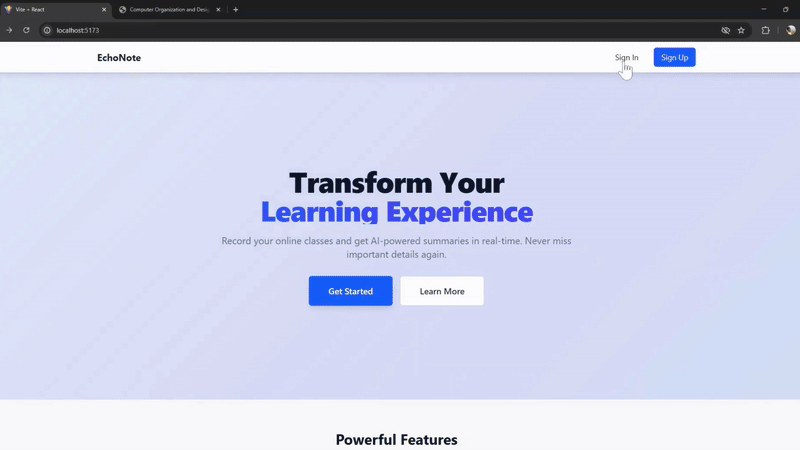
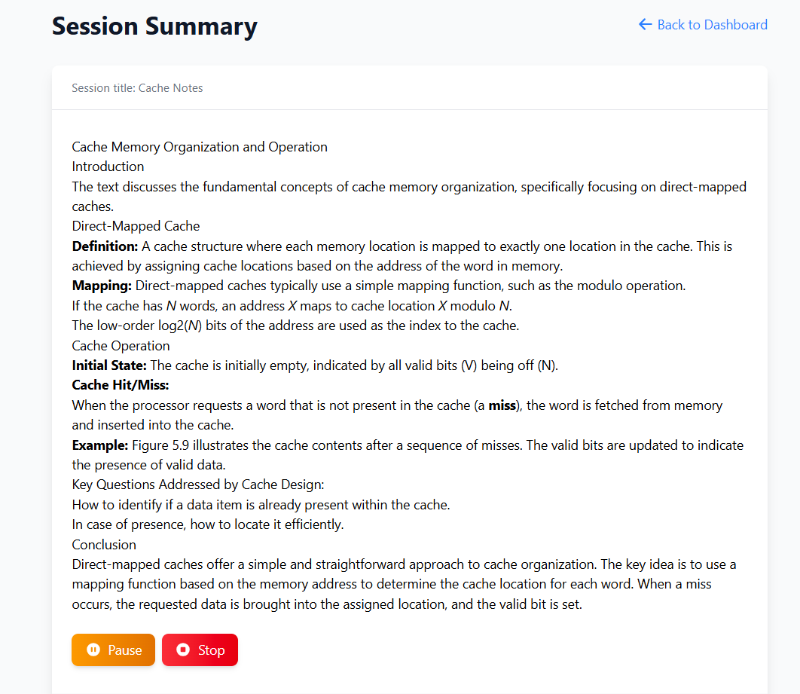

# 🎙️ EchoNoteAI — AI Meeting Summarizer

EchoNoteAI is your personal AI-powered meeting assistant. It records your online meetings and uses generative AI to summarize them — so you never miss a detail again.

🚀 **One-click record. Seamless summarization. Instant replay.**

---

## 🌟 Features

- 🧩 **Browser Extension** — Screen-record your meetings effortlessly.
- 🔒 **Authentication** — Secure sign-up/login with Clerk.
- 📦 **Session Storage** — All your recordings and summaries in one place.
- 🤖 **OCR + AI Summarization** — Automatically convert screen recordings into concise summaries using OCR and Gemini API.
- 🔊 **Text-to-Speech** — Playback your meeting summary like a podcast.

---

## ✨ Demo



> 👆 Shows login/signup flow and dashboard view.


> 👆 Demonstrates extension recording and session creation.

<!-- Optional additional image -->

> 👆 Summary of the meeting/class.

---

## 🛠️ How It Works

### 1. 📝 Sign Up
- User signs up via the EchoNoteAI **website** (React + Clerk).
- Auth info is stored in cookies and cleared on logout.

### 2. 🔌 Install the Extension
- Manually load the extension in Chrome:
  - Go to `chrome://extensions/`
  - Enable **Developer Mode**
  - Click **"Load unpacked"**
  - Select the `extension/` folder

### 3. 🎥 Start Recording
- Click "Record" in the extension.
- Screenshots are captured every 3 seconds and sent to the server (base64-encoded).
- Each session is stored in MongoDB with a unique `sessionId`.

### 4. 🧠 OCR + AI Summary
- Each image is processed using **OCR.Space API**.
- Extracted text is concatenated and stored.
- When you open a session, the full text is summarized using **Gemini API** (only once per session).

### 5. 📚 View or Listen to Summary
- Summaries are shown on your dashboard.
- You can read or use **Text-to-Speech (TTS)** to listen.

---

## 🧱 Tech Stack

| Component       | Technology Used                        |
|----------------|---------------------------------------- |
| 🌐 Website      | React, TailwindCSS, Clerk Auth         |
| 🧩 Extension    | HTML, CSS, JavaScript                  |
| 🖥️ Server       | Node.js, Express.js, MongoDB           |
| 🧠 AI APIs      | OCR.Space API, Gemini API              |
| 🔊 TTS          | SpeechSynthesis                        |

---

## 📁 Project Structure

```
EchoNoteAI/
├── client/         # React frontend
├── extension/      # Chrome extension
├── server/         # Node.js backend
├── assets/         # Images, GIFs
└── README.md
```

---

## 🧪 Local Testing Instructions

### 1. 🚀 Run the Website Locally

```bash
cd client
npm install
npm run dev
```

Runs the frontend (React + Tailwind) on `http://localhost:5173`.

---

### 2. 🔧 Run the Server

```bash
cd server
npm install
npx nodemon server.js
```

Make sure MongoDB is running and connected.

---

### 3. 🧩 Load the Extension in Chrome

1. Open Chrome and go to: `chrome://extensions/`
2. Turn on **Developer mode**
3. Click **Load unpacked**
4. Select the `extension/` folder

---

## 👨‍💻 Authors

Built with ❤️ by Hrushikesh Musaloj & Mudit Kesharia
